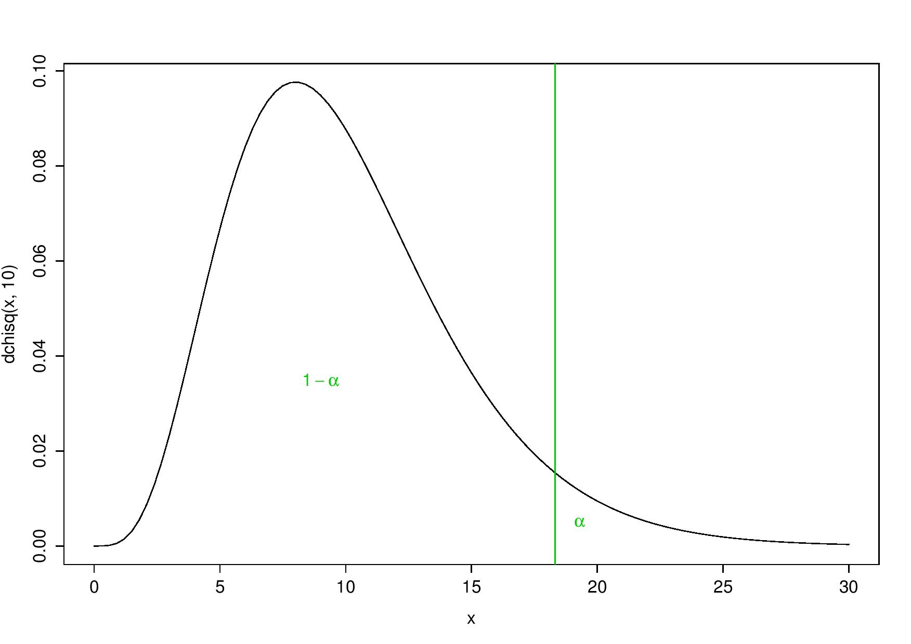
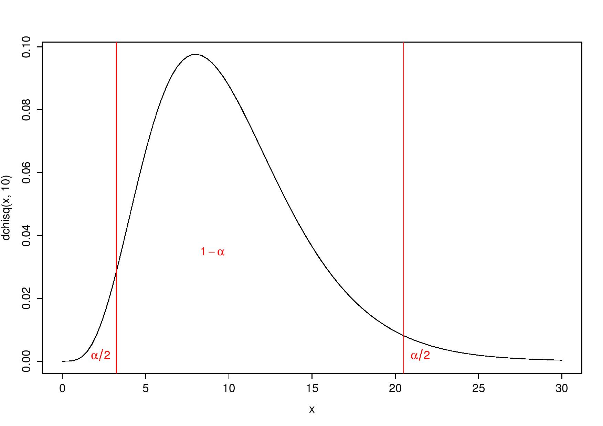
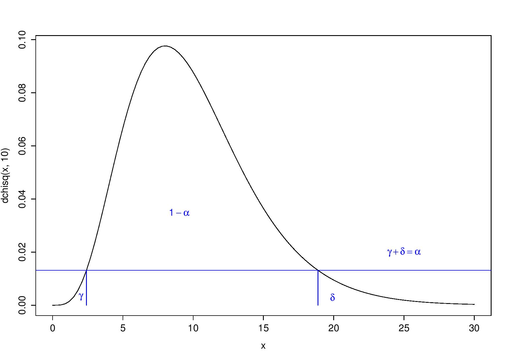
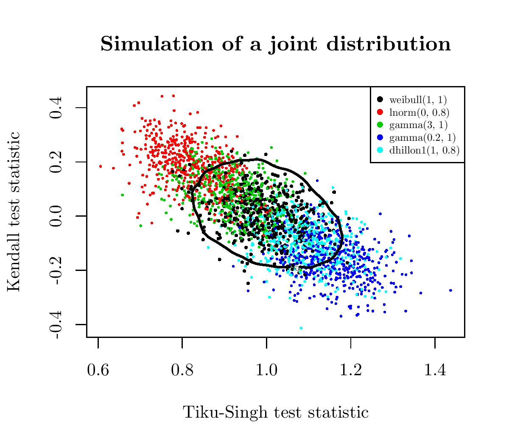

# On decision boundaries of tests
Florian Privé  
August 4, 2016  

***

In this post, I will talk about an alternative way to choose quantiles for tests, those you choose in order to have a 95% confidence interval (5% of type-I error). 
I will then show that this can be used to combine tests.
I won't go into details, just give some ideas with two examples in R.

## Example with the chi-squared distribution

Say that you have a test whose values under the null hypothesis ($H_0$) follow a chi-squared distribution with 10 degrees of freedom ($\chi_{10}^2$).

You can choose

* to reject $H_0$ only for the largest values of the statistic with significance $\alpha = 5\%$, which means rejecting the null hypothesis for values that are larger than the 95-percentile:

One-tailed test

* or to reject $H_0$ for both largest and smallest values of the statistic. Indeed, smallest values could be considered "too good to be true". Then, $H_0$ is rejected for values smaller than the 2.5-percentile or larger than the 97.5-percentile:

Two-tailed test

__Why choosing? Why not letting the test choose by itself?__ 

What do I mean by this? If you make the boundary on the values of the density of the test statistic, not on the values, you always obtain a one-tailed test whatever is the distribution of the test statistic. You then reject all values that have a corresponding density lower than the 5-percentile. Ok, I'm not clear even if I do my best, so let's see what this means in image:

Always a one-tailed test, but with respect to the y-axis

I see this as rejecting the 5\% less probable values ("probable" in terms of the test statistic's density).

## More convincing: application to the combination of tests

Combining tests may be a way to get a more powerful test.

Say now that you have two goodness-of-fit test statistic for the Weibull distribution (GOFW) (a well-known distribution in survival analysis). How to combine them? The best way I can see is to use their joint distribution. This distribution has a density, as before, so we can find a threshold on this distribution so that only 5% of the values of this distribution have a density under this threshold. This threshold is also called a 95%-contour.

Again, an image will be clearer than words. I drew several samples of size 50 from the Weibull distribution and three alternatives to the Weibull distribution: the Gamma, Log-Normal and Dhillon I distribution. For all these samples, I computed the corresponding values of the two GOFWs, and I plotted these paired values:

So, in black are the pair's values for several samples of the weibull distribution (the null hypothesis) and the alternatives are spread around. We have also in black the 95%-contour for $H_0$. So, points outside of this boundary correspond to samples for which we reject the null hypothesis.

## In practice

In practive, often and especially in the case of small sample sizes, you don't know the distribution of the values under $H_0$. So, Monte Carlo (MC) simulations under $H_0$ are used to get approximate quantiles, but you could also get non-parametric estimation of the density (for example with function _kde_ of R package _ks_) in 1D or in 2D. Then, from this estimation you could get the corresponding estimated densities for any values, especially for the values of the MC simulations which would get you the required 5-percentile of the density.

This idea can be generalized to the combination of more tests (3D-density, etc.) but there can be a problem with the density's estimation in higher dimensions.

***

If there are people interested, I could do another post which would show the R code to do the simulations, get the different decision boundaries and get the power of the tests. 
